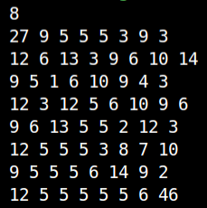
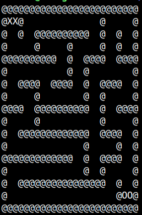

# Installation

To get started, make sure you have both the Mars simulator and Java installed. If you haven't done so already, you can download them from the following link: [Mars Simulator Download](https://courses.missouristate.edu/KenVollmar/MARS/download.htm).

Once downloaded, update the path of the newly downloaded simulator in the `exec.sh` script:

```bash
java -jar [path of the Mars simulator] projetLaby.s
```

# Usage

Execute the following command to launch the program:

```bash
$ ./exec.sh
```

Upon running the program, you will be prompted to enter the maze length. Ensure that you input a positive integer, though note that the program may not be flawless.

After specifying the maze length, your terminal should display something similar to the example shown below:


Next, copy the output from the single number in the first row to the last row and paste it into a file, for example, `maze.txt`. Utilize the `print_maze.sh` script to print the maze:

```bash
$ ./print_maze.sh maze.txt
```

You can expect to observe a result similar to this:



The `XX` is the entry point and `00` is the destination point.

# Conclusion

As evident, it would be more efficient to automatically redirect the generated labyrinth into a file instead of displaying it in the terminal. Unfortunately, we didn't have the time to implement this functionality. Feel free to work on it if needed.
